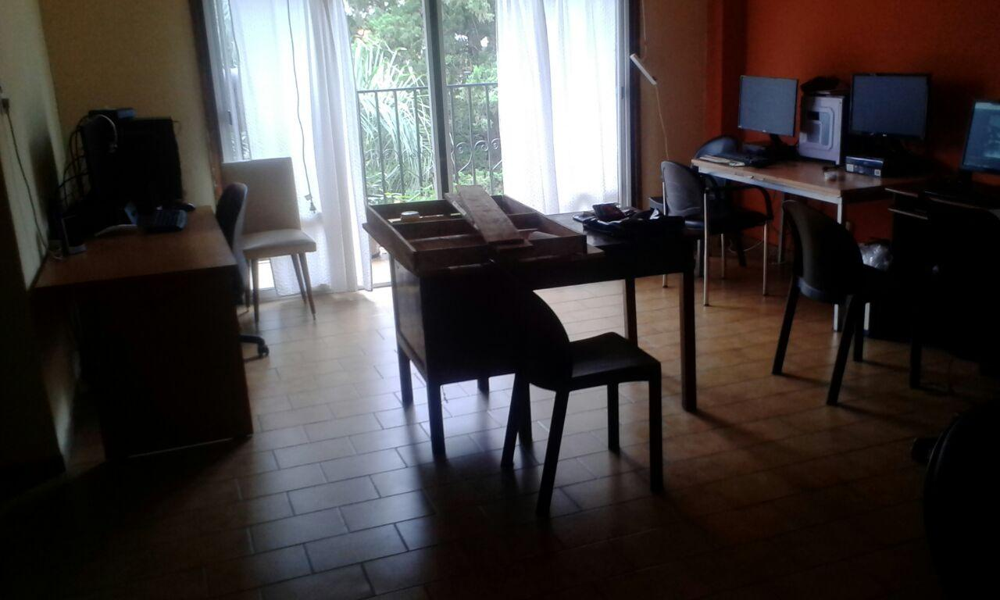

% Hackatory, espacio libre
% Eloy Espinaco (@eloyesp)
% 28 de Mayo de 2019

## El software libre se queda corto

"Si uno quiere pensar una alternativa [al copyright] no alcanza con atacar el
concepto de propiedad intelectual, ya que es sólo una coyuntura"

Eugenia Marichal y Ana Bonet

## Imre Lakatos y los monstruos

Pensar el _espacio_ desde las *cuatro libertades*.

## ¿Qué es hackatory?

- Nuestra oficina

- Un espacio de coworking

- Lugar de reunión

> - Ojalá fuera fácil de describir

---

## Usar (Libertad 0)

"La libertad de ejecutar el programa cómo se desee, con cualquier propósito."

. . .

Por defecto **sí**

## Aprender (Libertad 1)

"La libertad de estudiar cómo funciona el programa, y cambiarlo para que haga lo
que usted quiera."

. . .

La letra chica.

## Compartir (Libertad 2)

"La libertad de redistribuir copias para ayudar a otros"

. . .

Invitar a otros.

## Replicar (Libertad 3)

"La libertad de distribuir copias de sus versiones modificadas a terceros"

. . .

Documentar, publicar y promover este tipo de espacios.

## Están invitados

https://hackatory.gitlab.io

. . .

@hackatory

. . .

Av. Freire 3043 dpto: 3
