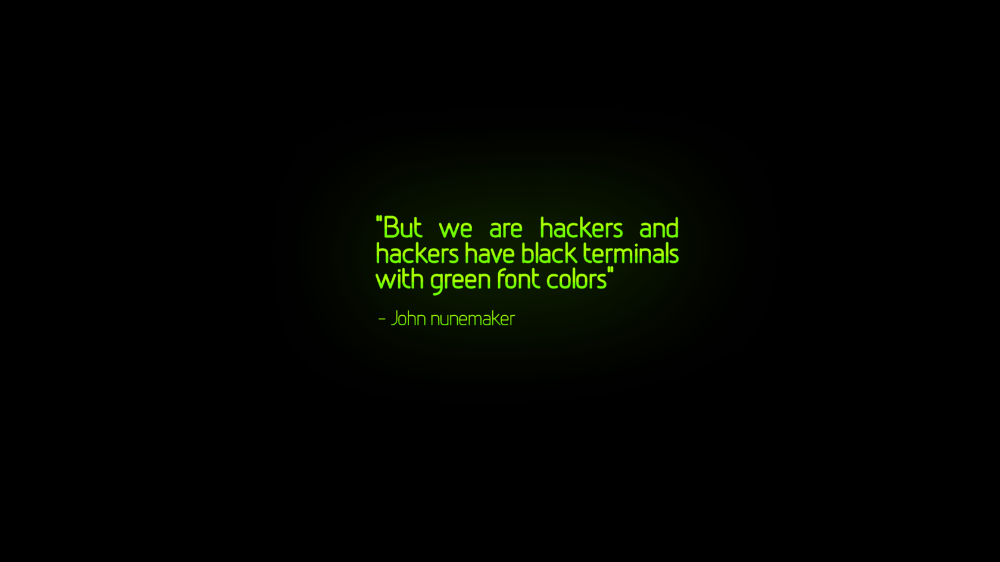

% La carrera de hacker
% Eloy Espinaco (@eloyesp) ; Pablo Oldani (@olvap)
% 24 de Septiembre de 2014

## Quienes somos

- Programadores
- Nerds
- Fanas del software libre

## ¿Qué carrera seguir?

> "Uno de los peores errores si querés ser escritor, es inscribirte en la carrera de letras."

> - Algunos de ustedes saben que van a estudiar,
> - otros saben de que quieren trabajar,
> - y algunos no saben que van a hacer la semana que viene.

## ¿Qué es un hacker?

Un hacker no es un cracker.

> - los hackers crean internet
> - los hackers disfrutan resolviendo problemas

## ¿Cómo se hace para ser hacker?

> Hacker no es una carrera universitaria.

> - aprendé inglés
> - aprendé html

## Aprendé a usar linux

## Bienvenido a la línea de comandos

> - es el ámbito natural del programador
> - Aprendé lo básico. No usés ides, aunque parezca anticuado.

## Aprendé a programar

> - Bienvenido al software libre
> - ¿qué es software libre?

## ¿Cuáles son las ventajas del software libre?

> - es difícil de usar
> - tiene fallos
> - hace pocas cosas
> - **IMPORTANTE** suscribíte a una lista.

## Opiniones de Hackers sobre la universidad

> "Materias con contenido muy des-actualizado." Jorge Shirai, programador en
  Altoros.

> "Yo les diría que tengan en cuenta que hoy todo se encuentra en internet y
  que hasta que llega en castellano a un libro el tiempo que se pierde es
  valiosísimo." Juan Pablo Taulamet, programador Freelance y docente
  universitario.

> "Materias que jamas use ni usaré que no me aportaron nada, contenidos
  obsoletos, docentes desactualizados y desmotivados." Manuel García,
  director de operaciones en Altoros.

## Muchas gracias

Bibliografía:

- Cómo convertirse en hacker: http://biblioweb.sindominio.net/telematica/hacker-como.html

> - Preguntas?
